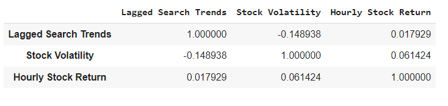
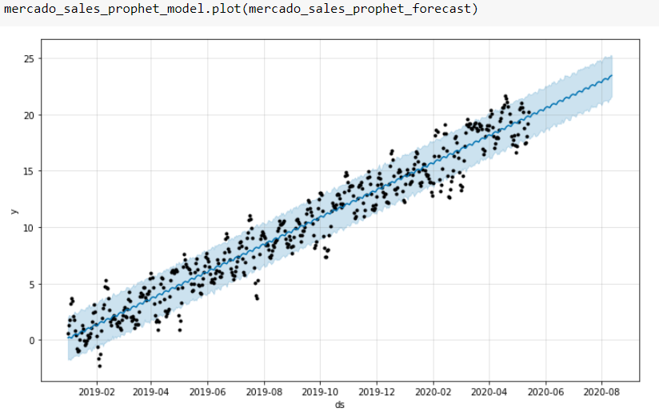

# MercadoLibre Forecast and Analysis of Search Trends and Revenue
This Jupyter notebook is meant to demonstrate how MercadoLibre's stock price is affected by its Google search traffic seasonality over 2015 - 2020, along with a forecast of how their traffic will do towards the end of 2020, as well as a short forecast for revenue using Facebook Prophet to create the forecasts.
The notebook contains the search traffic data, stock close data, and revenue, which is then used to show other insights like daily return, which are then also used to develope more insights using plots and different types of tables.

---

## Technologies

### Libraries:
* Pandas
* hvplot.pandas
* Holoviews
* Prophet from fbprophet
* datetime
* clear_output from IPython.display

### Dependancies:
* %matplotlib inline

The language of this notebook is Python on the Anaconda developement environment, worked upon on Google Colab. The libraries used that come with Anaconda Python are Pandas, datetime, and IPython.display. For the others you must install them.

---

## Installation Guide

At the start of the notebook, if working through Google Colab like this was written on, enter this:

```
from IPython.display import clear_output
try:
  !pip install pystan
  !pip install fbprophet
  !pip install hvplot
  !pip install holoviews
except:
  print("Error installing libraries")
finally:
  clear_output()
  print('Libraries successfully installed')
  
```
If ran correectly `Libraries successfully installed` should print. If not `Error installing libraries` will print and you will need to try again.

---

## Usage

#### Example of a correlation table for MercadoLibre:



#### Example of a plotted forecast for revenue for MercadoLibre:



All info is already input and worked on within the Jupyter file. Simply start from the top and go down the page to view relevant data, calculations, analysis, and notes.

---

## Contributor

Isaiah T Tensae